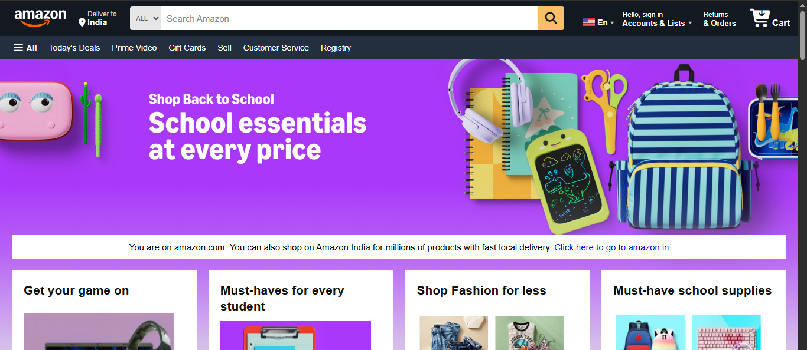

 

# 🛒 Amazon Clone (HTML & CSS)

An Amazon homepage clone built using **HTML5** and **CSS3**. This project recreates the look and feel of Amazon's landing page, including the navigation bar, hero section, product cards, and footer. The main objective of this project was to improve my front-end development skills by practicing HTML structure and CSS styling.

---

## 🚀 Features

- Amazon-inspired user interface
- Navigation Bar
- Hero Banner
- Product Category Cards
- Footer Section
- Font Awesome Icons
- Clean and Organized Code

---

## 🛠️ Technologies Used

- HTML5
- CSS3
- Flexbox
- CSS Grid
- Font Awesome

---

## 📂 Project Structure

```
amazon-clone-html-css/
│── amazon.html
│── amazonstyle.css
│── images/
│── README.md
```

---
## 🌐 Live Demo

🔗 https://rksahu-ds.github.io/amazon-clone-html-css/

## 📸 Preview



## 🎯 Purpose

This project was created for learning and practicing front-end web development concepts such as:

- Semantic HTML
- CSS Styling
- Flexbox
- CSS Grid
- Layout Design
- UI Recreation

---

## 📬 Connect with Me

**GitHub:** https://github.com/RKSahu-DS
